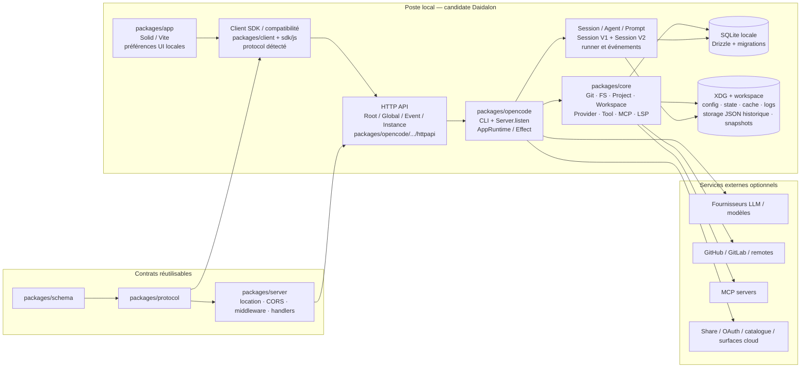

# Daidalon — architecture actuelle et cadre d’évolution backend/BDD

**Statut :** audit documentaire DA40-007, 2026-09-06
**Révision observée :** `1b327889841111256dfbc88f9cb063f848cc661b` sur `40-tooling`
**Source amont déclarée :** `anomalyco/opencode` (`package.json:120-123`)
**Périmètre exécuté vérifié :** UI locale `http://127.0.0.1:4440` → serveur local `http://127.0.0.1:4140`

Ce document distingue trois objets souvent confondus : la largeur du dépôt amont, l’architecture réellement lancée dans la candidate locale et la cible fonctionnelle Daidalon. Les chemins et numéros de ligne sont des repères dans la révision auditée ; les ports et processus sont des mesures du smoke DA40-003, pas une promesse de configuration universelle.

## Réponse courte

| Question | Réponse factuelle au 2026-09-06 |
|---|---|
| Projet classique ou monorepo ? | Monorepo Bun : `package.json:25-32` déclare `packages/*`, `packages/console/*`, `packages/stats/*`, `packages/sdk/js` et `packages/slack`. |
| Un ou plusieurs modules ? | Plusieurs packages, avec deux surfaces principales dans le parcours local : `packages/app` (UI Solid/Vite) et `packages/opencode` (CLI + runtime + listener HTTP). Les packages `core`, `schema`, `protocol`, `client`, `server`, `llm` structurent leurs contrats et services. |
| Backend actuel ? | Oui : un backend local HTTP fourni par `packages/opencode`. `src/server/server.ts` appelle `Server.listen`; le smoke DA40-003 a observé Bun PID 27514 sur `127.0.0.1:4140`. Ce n’est pas encore un backend SaaS distant. |
| BDD actuelle ? | Oui : SQLite locale ouverte par Bun, pilotée par Drizzle/Effect. `packages/core/src/database/database.ts` calcule `Global.Path.data/opencode*.db`, active WAL et applique les migrations. |
| Tout est-il dans SQLite ? | Non. Des préférences UI restent dans le stockage navigateur/plateforme, et des fichiers locaux persistent configuration, authentification, cache, logs, snapshots, sorties d’outils et une couche JSON historique. SQLite est l’autorité de la session/runtime moderne, pas l’unique stockage de l’écosystème. |
| Faut-il un backend distant maintenant ? | Non pour la cible locale mono-utilisateur du Sprint 1 : le couple UI + serveur local est déjà démontré. Il devient justifié si le produit exige comptes multi-utilisateurs, partage/coédition, orchestration centralisée, exécution persistante hors poste ou politique centralisée. |
| Faut-il une BDD distante maintenant ? | Non pour un poste local mono-utilisateur. Elle devient justifiée si l’état doit être partagé, audité, répliqué entre appareils, concurrent entre utilisateurs ou durable indépendamment du poste. |

## 1. Trois vues à ne pas confondre

### 1.1 Dépôt amont

Le dépôt nommé `opencode` est un monorepo privé Bun versionné `1.18.29`. Ses workspaces regroupent l’application, le runtime, des bibliothèques de contrats, le TUI/CLI/desktop, ainsi que des surfaces cloud et auxiliaires : console, stats, documentation web et Slack. Les manifests montrent notamment :

- `packages/app` : frontend Solid/Vite et tests browser ;
- `packages/desktop` : shell Electron ;
- `packages/opencode` : CLI, commandes `serve`/`web`, runtime et routes ;
- `packages/core` : services métier et persistance SQLite ;
- `packages/schema`, `packages/protocol`, `packages/client`, `packages/sdk/js`, `packages/server` : contrats, client et adaptateurs HTTP ;
- `packages/session-ui`, `packages/ui`, `packages/tui`, `packages/llm`, `packages/codemode` : présentation, terminal, modèles et orchestration ;
- `packages/console/*`, `packages/stats/*`, `packages/web`, `packages/slack` : surfaces complémentaires du projet amont.

Les dépendances distantes de console/stats sont réelles dans le dépôt mais ne sont pas la preuve de la BDD de la candidate locale. Par exemple, `packages/console/core/package.json` mentionne PlanetScale/Postgres/SST et `packages/stats/core/package.json` mentionne PlanetScale/Athena ; ces packages sont des surfaces cloud amont, non le chemin `packages/app` → `packages/opencode` mesuré ici.

### 1.2 Architecture réellement exécutée

Le smoke reproductible DA40-003 a observé :

```text
Node/Vite — packages/app       127.0.0.1:4440  HTTP 200
        │ HTTP + SDK/compatibilité
        ▼
Bun — packages/opencode        127.0.0.1:4140  /global/health = { healthy: true, version: "local" }
        │
        ├── AppRuntime / Effect
        ├── SQLite + Drizzle sous Global.Path.data
        ├── fichiers XDG, Git, workspaces/worktrees, LSP, PTY, MCP
        └── fournisseurs LLM/services externes à la demande
```

Les preuves sont `.project/tasks/DA40-003-socle-local-reproductible/manifest.json` et `.project/tasks/DA40-003-socle-local-reproductible/evidence/{process-cwd.txt,listeners.txt,http-smoke.json,health.response}`. Elles établissent les processus, cwd, ports et réponses HTTP de cette candidate ; elles n’établissent ni exécution desktop, ni appel fournisseur, ni assemblage inter-worktrees.

### 1.3 Cible Daidalon

Daidalon vise à ajouter une lisibilité de projet, sprint, tâche, APEX et worktree autour de ces fondations. Les documents produit décrivent cette cible, mais le schéma SQLite observé ne contient pas de tables MT Tasks/APEX ni de contrat de lease de worktree. Les rattachements durables promis par la conception (`docs/product/conception.md:193-205`) restent donc une évolution produit à concevoir, pas un fait du runtime actuel.

## 2. Schéma des frontières et des flux



Le sens des flèches est une dépendance/interaction, pas une indication que tous les fournisseurs sont appelés à chaque session. `packages/server` est une bibliothèque de contrats/middleware et de handlers réutilisables ; le processus qui écoute effectivement est `packages/opencode/src/server/server.ts`.

## 3. Carte des modules

| Zone | Responsabilité observée | Preuves principales | Dans la candidate locale ? |
|---|---|---|---|
| UI | Navigation, sessions, fichiers, sélection serveur, préférences et rendu Solid/Vite | `packages/app/package.json:15-31`, `packages/app/vite.config.ts`, `packages/app/src/context/server.tsx`, `server-sdk.tsx` | Oui, UI 4440 |
| Client/SDK | Création du client HTTP, détection V1/V2, compatibilité, événements et appels API | `packages/app/src/context/server-sdk.tsx`, `packages/app/src/utils/server.ts`, `packages/client`, `packages/sdk/js` | Oui, chargé par UI |
| Schema/Protocol | Types et API partagés entre client et serveur | `packages/schema`, `packages/protocol`, `packages/opencode/src/server/routes/instance/httpapi/api.ts` | Oui, transitivement |
| Server package | CORS, auth, location, middleware, handlers et routes réutilisables | `packages/server/src/{routes,handlers,middleware,location}.ts` | Oui transitivement ; pas le listener autonome |
| Runtime/backend | CLI, commandes `serve`/`web`, listener, composition de services et UI embarquée éventuelle | `packages/opencode/src/index.ts:52-106`, `src/server/server.ts:70-100`, `src/server/routes/instance/httpapi/server.ts` | Oui, processus 4140 |
| Core | Git, filesystem, projet, workspace, provider, tools, session et services Effect | `packages/core/package.json:8-13`, `packages/opencode/src/effect/app-runtime.ts:10-111` | Oui, selon le parcours |
| Session/agent | Sessions, messages/parts, admission prompt, runner LLM, compaction, permissions, événements | `packages/opencode/src/session`, `packages/core/src/session`, handlers Session | Oui |
| Stockage | SQLite/Drizzle principal, fichiers XDG et JSON historique | `packages/core/src/database/*`, `packages/core/src/global.ts`, `packages/opencode/src/storage/storage.ts` | Oui |
| Git/workspace | Résolution du projet, branches/worktrees, emplacement et copies | `packages/opencode/src/project`, `src/worktree`, `packages/core/src/project`, `src/control-plane` | Présent ; intégration Daidalon à sécuriser |
| Desktop/TUI/CLI | Shells alternatifs autour du runtime | `packages/desktop`, `packages/tui`, `packages/cli`, `packages/opencode/src/index.ts` | Déclarés ; non inclus dans le smoke web |
| Console/stats/web/Slack | Produits/surfaces amont complémentaires avec leurs propres chemins et dépendances | manifests correspondants | Non revendiqués dans le parcours local |

Les dépendances runtime suivent la règle du worktree : Schema → Core/Protocol, puis Core/Protocol → Server ; le client peut dépendre de Schema/Protocol mais pas de Core/Server. `sdk-next` compose Client, Core et Server pour des usages ciblés.

## 4. Flux principaux réellement possibles

### 4.1 Ouverture et navigation

1. L’UI conserve une liste de serveurs et de projets par scope dans le stockage navigateur/plateforme (`packages/app/src/context/server.tsx` et `src/utils/persist.ts`).
2. Le client crée un SDK HTTP pour le serveur sélectionné, détecte son protocole et expose l’API compatible (`packages/app/src/context/server-sdk.tsx`).
3. Le serveur local résout les routes globales et instance via `HttpApiApp.createRoutes` (`packages/opencode/src/server/routes/instance/httpapi/server.ts`).
4. Les routes de fichier/location consultent le filesystem et le contexte d’instance ; les routes projet/session consultent Core et SQLite.

### 4.2 Session, agent et outils

`AppLayer` compose explicitement `Database`, `Session`, `SessionProjector`, `SessionProcessor`, `SessionPrompt`, `LLM`, `ToolRegistry`, `Git`, `Workspace`, `Worktree`, `MCP`, `LSP`, `Permission` et les autres services (`packages/opencode/src/effect/app-runtime.ts:10-111`). Une session peut donc lire/écrire des fichiers locaux, appeler Git, lancer des outils ou solliciter un fournisseur LLM ; l’autorité de ces effets reste le processus local et les contrôles de permission observés, pas une isolation SaaS implicite.

Les chemins modernes `Session` et `MessageV2` importent `Database.Service` et les tables Drizzle (`packages/opencode/src/session/session.ts`, `src/session/message-v2.ts`). Les imports `@opencode-ai/sdk/v2` dans l’UI ne suffisent pas à conclure que chaque instance observée est V2 : DA30-003 a montré qu’un health `healthy:true` faisait sélectionner la compatibilité V1 pour l’instance de smoke, tandis que l’admission V2 existe sur un autre chemin de handlers.

### 4.3 Événements et synchronisation locale

Les groupes HTTP déclarés dans `packages/opencode/src/server/routes/instance/httpapi/api.ts` couvrent notamment Global, Event, Config, File, Instance, MCP, Project, Provider, PTY, Question, Permission, Session, Sync, TUI et Workspace. Les événements durables sont projetés dans SQLite (`event_sequence`/`event`) et relayés vers l’UI via les flux HTTP/événements. Cela fournit une synchronisation entre UI et processus local ; ce n’est pas une réplication multi-postes.

## 5. Persistance et chemins

### 5.1 Racines locales

`packages/core/src/global.ts` construit les racines à partir de `xdg-basedir` :

| Racine | Usage observé |
|---|---|
| `Global.Path.data` | BDD, logs, `storage/` JSON historique, auth, MCP auth, snapshots, repos/cache de données et sorties d’outils selon les services |
| `Global.Path.config` | configuration globale et plugins ; configuration projet sous `.opencode/` |
| `Global.Path.state` | état durable runtime, modèles sélectionnés et métadonnées de plugins |
| `Global.Path.cache` | modèles, binaires et caches de découverte |
| `Global.Path.tmp` | fichiers temporaires et plans/outils temporaires |
| `Global.Path.log` | logs runtime |
| `Global.Path.repos` | répertoires Git auxiliaires gérés par le runtime |

Le chemin effectif est configurable par les flags/environnement de test, donc une recette doit enregistrer les racines résolues plutôt que déduire un chemin absolu universel.

### 5.2 SQLite/Drizzle actuelle

`packages/core/src/database/database.ts` :

- choisit `:memory:`, un chemin absolu ou `Global.Path.data/<nom>` selon `OPENCODE_DB` et le canal d’installation ;
- utilise `opencode.db` pour `latest`, `beta`, `prod` ou lorsque le channel DB est désactivé ;
- fournit Drizzle via l’adaptateur Bun SQLite ;
- active WAL, `synchronous=NORMAL`, timeout d’attente, cache et clés étrangères ;
- applique `DatabaseMigration` au démarrage.

Les tables générées par `packages/core/src/database/schema.gen.ts` et définies dans les modules Drizzle sont :

| Groupe | Tables / données |
|---|---|
| Projet/placement | `project`, `project_directory`, `workspace` |
| Session historique et V2 | `session`, `message`, `part`, `session_message`, `session_input`, `session_context_epoch`, `todo` |
| Événements | `event_sequence`, `event` |
| Identité/accès | `account`, `account_state`, `control_account`, `credential`, `permission` |
| Compatibilité/migration | `data_migration`, `session_share` |

Les colonnes de chemin sont validées/canoniques via `packages/core/src/database/path.ts`. Le schéma contient des identifiants projet/session/workspace et des chemins, mais aucune colonne native `mt_task_id`, `apex_task_id`, lease, génération d’écrivain ou HEAD Git contractuel. Les relations de persistance ne doivent donc pas être surinterprétées comme un contrat Daidalon déjà implémenté.

### 5.3 Fichiers locaux complémentaires

`packages/opencode/src/storage/storage.ts` conserve une abstraction JSON sous `Global.Path.data/storage`, avec clés `*.json`, verrous et migrations historiques. Elle sait migrer d’anciens répertoires `project/.../storage/session/...` vers `storage/project`, `storage/session`, `storage/message` et `storage/part`. Cette couche explique la coexistence historique ; les lectures courantes de `Session`/`MessageV2` auditées utilisent SQLite/Drizzle.

Autres fichiers locaux repérés : `auth.json`, `mcp-auth.json`, configuration `config.json`/`opencode.json(c)`, cache catalogue/modèles, logs, snapshots Git et store de sorties d’outils. Les préférences de serveur, thème, brouillons et vues UI utilisent le stockage navigateur/plateforme ; elles ne sont pas des lignes SQLite du runtime.

## 6. Dépôt amont, exécution locale et cible : tableau de décision

| Niveau | Ce qui est vrai | Ce qui ne doit pas être déduit |
|---|---|---|
| Dépôt amont | Plusieurs apps/packages, cloud, stats et adaptateurs distants existent dans les manifests. | Que chaque package est lancé par Daidalon ou que sa BDD distante sert les sessions locales. |
| Exécution observée | `packages/app` et `packages/opencode` sont actifs sur 4440/4140 ; UI et serveur communiquent par HTTP ; SQLite est locale. | Qu’un serveur local est une architecture sans backend, ou qu’un GET health prouve l’appel d’un modèle. |
| Cible Daidalon | Projet/sprint/tâche/APEX/worktree doivent devenir des objets visibles et durablement reliés. | Que MT Tasks/APEX, lease et ownership sont déjà dans le schéma ou que le SaaS multi-utilisateur est décidé. |

## 7. Limites de l’audit

- Le smoke est web/local ; desktop Electron, TUI, PTY/descendants OS, fournisseur LLM réel et intégration inter-worktrees ne sont pas revendiqués.
- Les ports 4140/4440 sont ceux de la candidate mesurée et ne remplacent pas la configuration standard de `serve`/`web` ni le port 4096 attendu par certains tests app.
- Les surfaces cloud ont été qualifiées par manifests et imports ciblés, pas déployées ni sondées.
- La présence du stockage JSON historique est établie par le code ; le contenu de données utilisateur n’a pas été inspecté ni migré.
- Le schéma Mermaid a été validé structurellement et relu comme texte ; aucune dépendance de renderer Mermaid n’est imposée par le dépôt dans ce bloc.
- Les affirmations de sécurité sont des frontières de conception et des constats de code, pas une certification d’isolation OS ou réseau.

## 8. Faut-il un backend distant ou une BDD distante ?

### 8.1 Décision pour la cible actuelle

**Pas maintenant pour le périmètre Sprint 1.** Daidalon a déjà un backend local : `packages/opencode` expose l’HTTP API consommée par `packages/app`. Il a déjà une BDD locale : SQLite/Drizzle sous `Global.Path.data`. Ajouter un service distant à ce stade augmenterait les surfaces d’authentification, synchronisation, disponibilité et migration sans répondre à un besoin démontré par le parcours mono-utilisateur/local.

Cette décision ne nie pas les services externes déjà optionnels : le runtime peut appeler un fournisseur LLM, un serveur MCP, un remote Git, un service de partage ou un catalogue. Elle signifie que l’état de projet/session et les effets locaux ne sont pas aujourd’hui placés derrière un backend Daidalon central.

### 8.2 Matrice de déclenchement

| Besoin observé | Conserver local UI + backend + SQLite | Ajouter un backend distant | Ajouter une BDD distante |
|---|---|---|---|
| Un seul utilisateur, un poste, fichiers et Git locaux | Oui. Le serveur local garde les effets près du workspace et SQLite garde l’historique. | Non requis. | Non requise. |
| Plusieurs appareils pour le même utilisateur | Possible seulement avec export/sauvegarde explicite. | Oui si une session doit continuer hors du poste ou si l’état doit être servi à distance. | Oui si les sessions, préférences ou métadonnées doivent être synchronisées durablement. |
| Plusieurs utilisateurs, partage ou coédition | Non, sauf partage de fichiers/artefacts volontairement séparé. | Oui : identité, auth, autorisation, API de collaboration et quotas. | Oui : tenants, membres, ACL, conflits, audit et rétention. |
| Agents/jobs longs qui doivent survivre à la fermeture du poste | Oui pour jobs strictement locaux et attachés au processus. | Oui : scheduler, workers, reprise et observabilité. | Généralement oui pour l’état durable de job, événements et checkpoints ; choisir selon le volume. |
| Besoin d’un historique central, audit, conformité ou restauration | Oui seulement avec sauvegarde locale contrôlée. | Optionnel si l’API distante ne fait que servir des exports. | Oui pour rétention, audit, recherche et restauration centralisés. |
| Données sensibles ne devant pas quitter le poste | Préférable ; réduire les appels externes et chiffrer les secrets locaux. | Non par défaut ; risque de déplacement de données et de secrets. | Non par défaut ; préférer stockage local/chiffrement et politique de purge. |
| Échelle de concurrence supérieure à un processus local | Limité par le poste et SQLite locale. | Oui si plusieurs clients/processus doivent partager une autorité. | Oui si les écritures concurrentes et lectures distribuées deviennent un contrat. |

### 8.3 Critères mesurables avant changement

Un changement ne doit être ouvert que si au moins un critère est accepté par le produit :

1. **Disponibilité** : le poste local ne peut plus assurer le service requis (reprise, jobs, uptime ou sauvegarde).
2. **Partage** : plusieurs utilisateurs/appareils doivent voir un même état avec une latence et une cohérence définies.
3. **Gouvernance** : audit, rétention, suppression, export, résidence ou politique d’accès exigent une autorité centrale.
4. **Capacité** : le volume, la recherche ou la concurrence dépasse le contrat acceptable d’un fichier SQLite local.
5. **Sécurité** : un proxy/backend est nécessaire pour ne jamais exposer certaines clés au client ou pour imposer une autorisation centrale.
6. **Produit** : la cible SaaS/multi-tenant est explicitement décidée ; elle ne doit pas être déduite de la présence de `packages/console`.

Si aucun critère n’est rempli, conserver l’architecture locale et améliorer les sauvegardes, la visibilité d’identité et la réconciliation locale. Un simple besoin de consulter un fournisseur LLM distant ne justifie pas une BDD distante : il s’agit d’une dépendance d’inférence, pas d’une autorité de persistance.

## 9. Impacts et prérequis d’une évolution

### Backend distant sans BDD distante

Option adaptée à un proxy stateless, une exécution distante ponctuelle ou un service d’authentification. Prévoir :

- contrat HTTP versionné et séparation claire entre état local et état distant ;
- authentification, autorisation par projet/session, rotation de tokens et limitation de débit ;
- politique explicite des chemins locaux : le serveur distant ne peut pas supposer qu’il voit le workspace du poste ;
- streaming/reconnexion, idempotence et gestion des timeouts ;
- télémétrie sans fuite de prompt, secrets ou contenu de fichiers ;
- tests réseau dégradé, compatibilité protocole et plan de repli local.

### BDD distante avec backend distant

Option nécessaire pour un état partagé ou centralisé. Elle impose avant implémentation :

- modèle d’identité/tenant et autorisations ;
- séparation des données de contrôle (tâches, sprints, APEX, leases) et des données de session/contenu ;
- stratégie de concurrence, versionnement, idempotence et résolution de conflits ;
- migration initiale depuis SQLite, export/reprise et rollback ;
- chiffrement au repos/en transit, gestion des secrets, rétention et suppression ;
- sauvegardes, restauration testée, monitoring, alertes, coûts et procédure d’incident ;
- décision sur la résidence des fichiers : ne pas copier un workspace Git local par défaut dans la BDD.

### Évolution locale progressive

Avant un service distant, une étape à faible risque peut formaliser les objets Daidalon dans la persistance locale : tâche/sprint/APEX, identité complète du checkout, génération d’écrivain et lease local, sans changer le runtime LLM. Cette étape doit garder `Project.ID`, `SessionID`, chemin canonique, branche/HEAD et références MT comme contrats distincts ; elle ne doit pas les cacher dans un champ JSON générique sans version ni validation.

## 10. Prochaines tâches APEX candidates

Ces intitulés sont des propositions conditionnelles, pas des cartes MT créées par DA40-007 :

| Déclencheur | Tâche APEX candidate | Sortie attendue avant Build produit |
|---|---|---|
| Besoin de rattacher durablement tâche/sprint/APEX au runtime local | « Modèle local tâche–sprint–APEX–session–checkout » | schéma d’identité, propriétaires, migrations SQLite, événements et reprise ; aucune implémentation implicite dans cet audit |
| Besoin de réserver un worktree à un seul écrivain | « Lease et réconciliation du checkout » | state machine, TTL non libératoire sans preuve de quiescence, génération écrivain et tests de crash |
| Plusieurs appareils/utilisateurs ou jobs persistants | « Backend d’orchestration distant » | contrat API, auth/tenancy, frontière des chemins, streaming, quotas et scénario offline |
| État partagé/audit centralisé | « Persistance distante et migration SQLite » | choix de stockage, mapping versionné, migration/reprise/rollback, rétention, sauvegarde et observabilité |
| Besoin uniquement de sauvegarde/export | « Export/import signé de l’état local » | format versionné, chiffrement, intégrité, restauration et compatibilité sans backend toujours actif |

DA40-007 ne choisit pas entre ces options et ne crée pas de backend/BDD. Le parent doit transformer une proposition en scope et carte MT seulement après décision produit explicite.

## 11. Conséquences opérationnelles

Tant que l’architecture reste locale :

- le poste et ses répertoires XDG sont la frontière de disponibilité ;
- SQLite et les fichiers doivent être sauvegardés selon une politique utilisateur, sans synchronisation silencieuse ;
- l’UI doit afficher serveur, dossier, branche et HEAD mesurés ;
- un appel fournisseur distant reste soumis aux permissions, à la minimisation des données et au mode de panne local ;
- la présence des packages cloud ne doit pas être utilisée comme preuve de déploiement Daidalon.

Si l’un des critères d’évolution est atteint, l’architecture locale doit rester compréhensible pendant la transition : afficher quelle autorité possède chaque donnée, quelle copie est en cache, quel événement est synchronisé et quel état est récupérable hors ligne.
